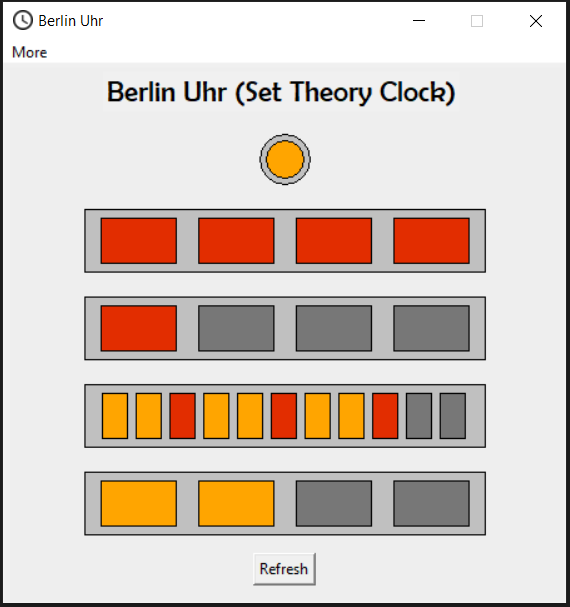

# Berlin-Uhr

<a href="https://www.python.org/" title="Go to the Python home page">
    
</a>
<p>
<a href="https://wiki.python.org/moin/TkInter" title="Go to the TKinter page">
    
</a>
<br>



### Table of contents
* [Introduction](#introduction)
* [About Berlin-Uhr](#about-berlin-uhr)
* [How to read it?](#how-to-read-it)
* [How to run the app?](#how-to-run-the-app)
* [Potential future aspirations](#potential-future-aspirations)

### Introduction
A couple of months ago I came across a [Reddit post](https://www.reddit.com/r/whatisthisthing/comments/f53vcu/walked_past_this_many_times_while_in_berlin_and/?utm_source=share&utm_medium=web2x) on r/whatisthisthing, where a person was trying to figure out what was an interesting digital street sign that they saw in Berlin. A few people replied with the correct answer of "Mengenlehreuhr" with a link to the Wikipedia page about it. After researching about the clock and learning how to read it, I became really interested with its concept and decided to write a replica computer-application of the clock. Below is the image from the Reddit post.


### About Berlin-Uhr
Berlin-Uhr (German for "Berlin Clock") or Mengenlehreuhr (German for "Set Theory Clock"), is the first public clock in the world that tells the time by means of illuminated, coloured fields, for which it entered the Guinness Book of Records upon its installation on 17 June 1975.
Commissioned by the Senate of Berlin and designed by Dieter Binninger, the original full-sized Mengenlehreuhr was originally located at the Kurfürstendamm on the corner with Uhlandstraße. After the Senate decommissioned it in 1995, the clock was relocated to a site in Budapester Straße in front of Europa-Center, where it stands today. (Source: [Wikipedia](https://en.wikipedia.org/wiki/Mengenlehreuhr)) 

### How to read it?
The Mengenlehreuhr consists of 24 lights which are divided into one circular blinking yellow light on top to denote the seconds, two top rows denoting the hours and two bottom rows denoting the minutes.

The clock is read from the top row to the bottom. The top row of four red fields denote five full hours each, alongside the second row, also of four red fields, which denote one full hour each, displaying the hour value in 24-hour format. The third row consists of eleven yellow-and-red fields, which denote five full minutes each (the red ones also denoting 15, 30 and 45 minutes past), and the bottom row has another four yellow fields, which mark one full minute each. The round yellow light on top blinks to denote even- (when lit) or odd-numbered (when unlit) seconds. 

### How to run the app?
1) Make sure you have Python installed.
2) Navigate to the app's folder/directory using the computer's Command Prompt/Terminal:
```
cd Berlin-Uhr
```
3) Run the Python app
```
python main.py
```

### Potential future aspirations
* Developing a mobile app version of the clock
* Developing a mobile widget version of the clock
* Creating an electronic version of the clock with a microcontroller
